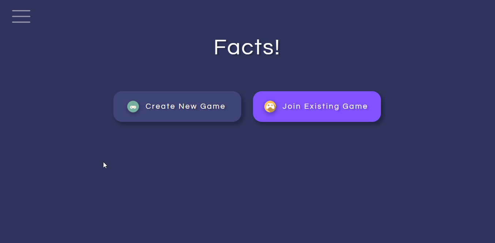

# Purpose
- _To improve remote team building_
- A collection of services designed to solve the client's problem of improving remote team building
- Consists of:
  - An platform that hosts/contains a variety of team building activities
  - A bespoke real-time, turn-based, multiplayer team building activity (named `Facts!`)

### Platform:

### Facts! game:

# How to run
- Install Node.js (if not already installed)
- Clone this repo
- To run the platform:
  - `cd` into the `platform` directory and then `npm i`
  - `npm start` to run the application locally
- To run the Facts! game:
  - `cd` into the `fact-game` directory and then `npm i`
  - `npm start` to run the game locally
  - The Facts! game requires a backend to play a game, which is available separately and not as part of this repository.

# Tools used
- Platform front-end:
  - HTML, CSS, JavaScript
  - React (via Create React App)
  - Jest (via Create React App)
  - Chakra UI components library
  - React Router
  - AWS SDK
  - AWS Cognito, AWS S3
  - Storybook (for development only)
  - Prettier, ESLint (for development only)
  - Jira, Confluence, Trello (project management)
- Facts! game front-end:
  - HTML, CSS, JavaScript
  - React (via Create React App)
  - Jest (via Create React App)
  - WebSockets
  - Material UI components library
  - React Router
  - AWS SDK
  - AWS Cognito
  - Storybook (for development only)
  - Prettier, ESLint (for development only)
  - Jira, Confluence, Trello (project management)

# What I learned
- Practiced producing and delivering software using agile methodology, whilst working in a fully distributed/remote team.
- Communicating regularly and precisely with team members is key, especially regarding blockers or delays.
- Conducting user research and creating user stories helps keep in mind the original problem throughout the process. User stories can be helpful to refer to, especially when making difficult decisions during the course of the project.
- Using Jira effectively to manage tasks, backlogs and sprints. We each took turns to assume the role of project manager. This helped us ensure the project was managed well and on schedule.
- Designing and developing a front-end (Facts! game) where the UI is server-driven and updates in response to real-time events received from the server.
- Learning packages/libraries (`react-use-websocket`) that abstract away some of the complexities of using WebSockets within a React application.
- Using component libraries like Material UI and Chakra to quickly create effective user interfaces.
- Implementing helpful, user-friendly tooltips and messaging to improve overall UX.
- Creating and configuring user pools and identity pools in AWS Cognito. Integrating the front-end with AWS Cognito's authorisation flow, so that authenticated clients can securely access back-end resources.

# Things to add
- Add more bespoke team building activities.
- Swap tables out for graphs for better looking visualisations (e.g. graphing libraries).
- Introduce concept of achievements e.g. awards for answering questions quickly/correctly/accurately/consistently.

# Created
Dec 2020 - Jan 2021 (4-week deadline)